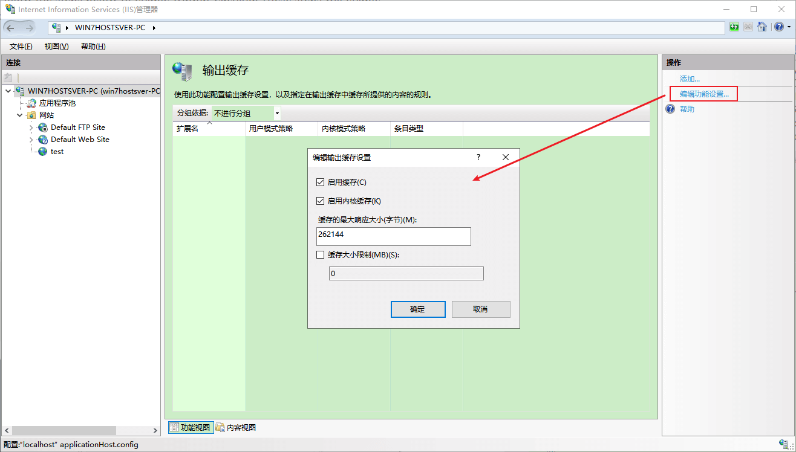
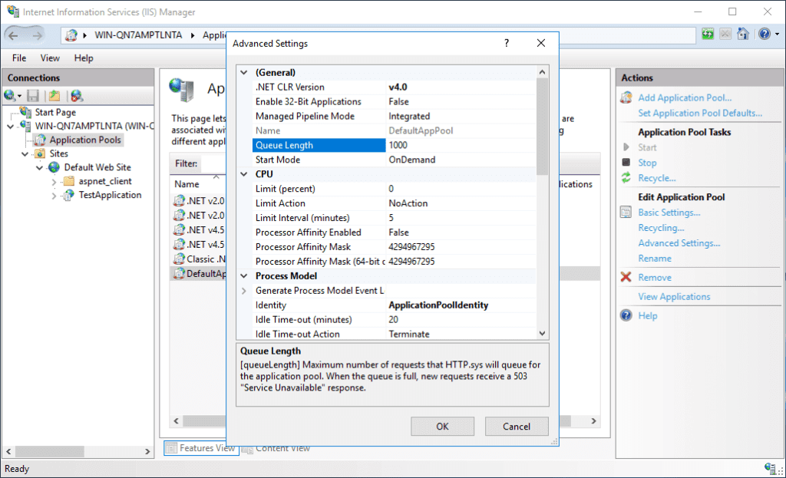

提高 IIS 性能的 9 个简单实用的建议【译】

[toc]

> 翻译自原文 [9 Easy and Practical Recommendations to Improve IIS Performance](https://port135.com/recommendations-improve-iis-performance-fine-tuning/)

IIS 托管着全球数百万个网站。借助于 IIS 管理器，可以轻松地创建和管理网站。使用默认功能和性能设置的网站，在大多数情况下提供的服务都是足够有效和实用的。但是，我们可能希望针对特定应用程序和场景对 IIS 性能进行微调。

# Fine-tuning IIS Performance 微调 IIS 性能

本篇文章将介绍 8 个潜在提高 IIS 性能的建议。大多数建议都与 IIS 7.0 和更新版本兼容，但有一些例外（在各自的部分中会提及这些例外情况）。

推荐的内容：

1. 输出缓存  —— Output Caching
2. 应用程序初始化 —— Application Initialization
3. 默认文档  —— Default Document
4. HTTP keep-alive      
5. 缓存控制头  —— Cache-control Header 
6. 空闲超时操作  —— Idle Time-out Action
7. 动态压缩 —— Dynamic Compression
8. 和 9. 其他选项（队列长度、启用 32 位应用程序） —— Queue Length, Enable 32-bit Applications

## 1. 输出缓存

> 适用于 IIS 7+

IIS 有 **内核模式** 和 **用户模式** 组件（`kernel-mode`、`user-mode`）。内核模式组件接收和路由 HTTP 请求、管理连接以及将响应发送回客户端。用户模式组件处理请求并准备响应。内核模式和用户模式级别都有响应缓存。

使用缓存允许 IIS 更快地处理请求。但是，随着缓存条目占用内存中的空间，物理内存的消耗会增加。建议监视内存使用情况并限制缓存可以使用的最大内存量。

### 内核模式缓存

HTTP.sys 是内核模式的一部分，它包括响应缓存（内核模式缓存），使用此缓存可以完全满足请求。

启用内核模式缓存可加快页面加载时间，减少带宽使用和数据传输量，并减少服务器负载，从而显著降低处理请求的 CPU 成本。

> bandwidth ：带宽

某些功能（如身份验证和授权）无法使用输出缓存提供。因此，**IIS 只允许在内核模式级别缓存静态内容，如 HTML、JavaScript、CSS 和图像**。

### 用户模式缓存

动态内容（如 ASP 和 PHP 页）可以在用户模式级别缓存。在用户模式级别，请求在容器（工作进程）中处理，这样可以提供更高的安全性和可管理性。

### 启用输出缓存

下面启用输出缓存的步骤，将会启用内核模式和用户模式的缓存。

1. 转到 IIS 管理器
2. 单击服务器名称
3. 双击“输出缓存”

  

4. 单击右侧“操作”菜单中的“编辑功能设置”（Action -> Edit Feature Settings）
5. 勾选“启用缓存”和“启用内核缓存”选项

  

6. 单击要为其启用输出缓存的网站
7. 双击“输出缓存”

  

8. 单击右侧“操作”菜单中的“编辑功能设置”
9. 选中“启用缓存”和“启用内核缓存”选项


10. 重新启动 HTTP 服务。在命令提示符下运行以下顺序的命令：

```sh
iisreset /stop
net stop http
net start http
iisreset /start
```

  

## 2. 应用程序初始化

> 适用于 IIS 7.5+

这是 IIS 中的一项功能，用于管理首次启动应用程序时发生的情况。在部署、服务器重新启动、IIS 重设置、应用程序池重启或应用程序池空闲时间 之后的启动过程，会影响首次访问网站(的用户)的速度。

对于大型应用程序，因为网站编译代码、初始化缓存、加载组件和生成文件，启动时间可能很长。

### 启用 应用程序初始化

下面的步骤介绍 启用 应用程序初始化。

注意：以下步骤适用于 IIS 7.5+。**IIS 7.5 要求安装应用程序初始化模块。此模块是 IIS 8+ 的内置模块，但在 IIS 安装过程中应该进行检查**：

  

步骤：

1. 转到 IIS 管理器
2. 单击“应用程序池”(`Application Pools`)
3. 选择要为其启用应用程序初始化的网站所使用的应用程序池
4. 单击右侧“操作”窗格中的“高级设置”
5. 从“启动模式”列表中选择“始终运行”(`AlwaysRunning`)【对于IIS 8及更低版本，除了“启动模式”选项外，还要将“自动启动(`Start Automatically`)”选项设置为“True”】

  

继续如下的步骤：

1. 在左侧“连接”窗格中，点击选择对应的站点或应用程序名称
2. 右侧“操作”窗格中点击“高级设置”
3. 在“预加载已启用(`Preload Enabled`)” 中选择 `True`。
4. 重启IIS（命令提示符中`iisreset`）

   

  

## 3. 默认文档

> 适用于 IIS 7+

IIS 使用模块来处理集成管道中的请求。默认文档模块是其中的一个模块。它处理转到应用程序目录根目录的请求。由于这些请求未指定文件名，因此默认文档模块将按照允许的默认文档列表进行搜索。这可能会对 IIS 性能产生负面影响。

通过减少默认文档列表并重新排序，可以增加应用程序响应时间。

编辑列表时，请确保仅包含该特定应用程序使用的默认文档。此外，请确保列表以最常访问的默认文档名称开头。

### 编辑默认文档列表

下面的步骤用于 编辑默认文档列表：

1. 转到 IIS 管理器
2. 单击要编辑“默认文档”列表的网站或应用程序
3. 双击“默认文档”
4. 编辑列表（删除未使用的文件名。将最常用的文件名移到顶部）

  

## 4. HTTP keep-alive

> 适用于 IIS 7+

当客户端访问网页时，浏览器会发出多个请求来下载整个页面。为了加载页面，浏览器也可能会为每个元素（如图像）启动单独的连接。

通过启用“HTTP keep-alive”选项，服务器可以为这些多个请求保持连接打开，从而提高服务器性能和响应时间。 

### 启用 HTTP keep-alive

按照以下步骤为网站或应用程序启用 HTTP 保持活动状态 选项：

1. 转到 IIS 管理器
2. 单击要启用“HTTP 保持活动状态”的网站或应用程序
3. 双击“HTTP 响应标头”
4. 单击“操作”窗格中的“设置常用标头”(`Set Common Header`)
5. 选择“保持 HTTP 连接”(`Enable HTTP keep-alive`)选项

  

6. 点击“确定”

  

> If your application is causing high CPU load due the incorrect usage of HttpClient object, check this post out: High CPU load in IIS web server caused by HttpClient

## 5. 缓存控制头

> 适用于 IIS 7+

当客户端首次访问网页时，请求由 Web 服务器处理，并通过网络发送响应。如果未设置缓存，则执行相同的步骤，即使网站没有更新，响应没有任何改变，也可能会非常耗时。如果设置了缓存，客户端将可以使用自己的缓存访问网站，从而显着缩短响应时间。由于服务器不为该客户端缓存的请求提供服务，这样还提高了服务器的性能。

缓存控制是一个 HTTP 标头。除了客户端机器外，此标头还用于 CDN、负载均衡器和代理。

缓存控制头有一个设置，用于说明资源应该在缓存中保留多长时间。

### 启用缓存控制标头

按照以下步骤为网站或应用程序启用缓存控制标头：

1. 转到 IIS 管理器
2. 单击要启用缓存控制标头的网站或应用程序
3. 单击“操作”窗格中的“设置常用标头”
4. 选择“使Web内容过期(`Expire Web content`)”选项
5. 选择“之后”。输入一个值。输入的值应该取决于更新内容的频率。例如，如果每周更新一次，请确保该值不超过 7 天。
6. 点击“确定”

  

## 6. 空闲超时操作

> 适用于 IIS 8.5+

IIS 中的请求由工作进程（w3wp.exe）处理。每个应用程序池都有一个或多个工作进程。

默认情况下，如果工作进程空闲（未收到任何请求）20 分钟，则会终止进程（空闲超时操作）。当工作进程终止后收到新请求时，用户会遇到消费资源的启动周期(`spin-up cycle`)。 

通过将“空闲超时操作”设置为“挂起(`Suspend`)”，可以防止在达到空闲超时阈值后工作进程被终止。

从理论上讲，这提高了Web服务器的性能，因为工作进程不需要进入启动进程，这意味着用户几乎可以立即访问站点。

实际上，如果应用程序具有高流量或使用大量内存，则可能不适合设置“挂起”选项：

- 高流量(`High-traffic`)应用程序将不断有访问者，因此,工作进程将始终保持活动状态。

利用“挂起”选项的网站应该是每天有20名或更少的访问者的网站。为了决定此选项，请检查您的流量模式。如果访问的时间超过超时值（默认为 20 分钟），则启用“挂起”是个好主意。请看[这篇文章](https://docs.microsoft.com/en-us/windows-server/administration/performance-tuning/role/web-server/tuning-iis-10#dynamic-worker-process-page-out-tuning)的例子。

- 使用大量内存的应用程序不适合“挂起”选项，因为计算机将工作进程使用的数据写入磁盘。由于数据量很大，`挂起`的成本将高于`终止`。

### 设置 空闲超时操作 为“挂起” Suspend

下面的步骤用于设置 空闲超时操作 为“挂起”：

1. 转到 IIS 管理器
2. 单击“应用程序池”
3. 选择要更改 空闲超时操作 的网站所使用的应用程序池
4. 单击“操作”窗格中的“高级设置”
5. 从“空闲超时操作”列表中选择“挂起”

  

## 7. 动态压缩

> 适用于 IIS 7+

默认情况下，IIS 压缩静态内容（图像、CSS 文件、HTML 文件等）以减少用于请求的带宽。

通过启用动态内容（如 ASP.NET 页面）的压缩，还可以节省动态内容的带宽，用于减少响应时间并提高 Web 服务器性能。

但是，启用动态压缩会增加 CPU 的额外负载（大约 5% 的 CPU 开销）。

### 启用动态压缩

此功能应先安装，然后再使用。

在服务器管理器中，确保安装了“动态内容压缩”。对于 Windows Server 2008 和 Windows Server 2008 R2，请参阅[此链接](https://docs.microsoft.com/en-us/iis/configuration/system.webserver/urlcompression#windows-server-2008-or-windows-server-2008-r2)中的说明。

  


安装后采用下面的步骤启用：

1. 转到 IIS 管理器
2. 单击要启用 动态压缩 的站点或应用程序
3. 双击“压缩”（`Compression`）
4. 选择“启用动态内容压缩”
5. 点击“应用”

  

## 8. 其他设置（队列长度、启用 32 位应用程序）

### 队列长度

应用程序池有一个名为“队列长度”的设置。此设置的值用于指定 HTTP.sys 可以排队的请求数， HTTP.sys 是管理和重路由请求的内核模式组件。

默认队列长度为 1000，这对于大多数 Web 服务器来说已经足够了。

如果 Web 服务器需要对超过 1000 个请求进行排队，IIS 会拒绝请求并记录 503 服务不可用 错误。没有计算最佳值的建议和公式。推荐监视队列大小，并仅在其大小接近 1000（默认值）时才增加此值。

  

### 启用 32 位应用程序

如果 Web 服务器中存在内存使用情况的问题，请考虑在应用程序池设置中启用该选项。因为 32 位应用程序使用的内存少于 64 位应用程序，启用此选项可减少内存使用量。

奖励内容！使用 CCS（集中式证书存储）可以加快 IIS 服务器的证书管理。查看这篇文章：[什么是集中式证书存储（CCS）以及如何使用它？](https://port135.com/2019/05/16/what-is-centralized-certificate-store-ccs-how-to-use-it/)

# 引用

- [Tuning IIS 10.0](https://docs.microsoft.com/en-us/windows-server/administration/performance-tuning/role/web-server/tuning-iis-10) (Microsoft Docs)
- [Configure the IIS Application Initialization module](https://blogs.msdn.microsoft.com/benjaminperkins/2014/01/07/configure-the-iis-application-initialization-module/) (MSDN Blogs)
- [HTTP Protocol Settings](https://docs.microsoft.com/en-us/iis/configuration/system.webserver/httpprotocol/) (Microsoft Docs)
- [Configuring Application Pool Settings](https://docs.microsoft.com/en-us/previous-versions/tn-archive/cc745955(v=technet.10)#configuring-application-pool-settings) (Microsoft Docs)
- [URL Compression](https://docs.microsoft.com/en-us/iis/configuration/system.webserver/urlcompression) (Microsoft Docs)