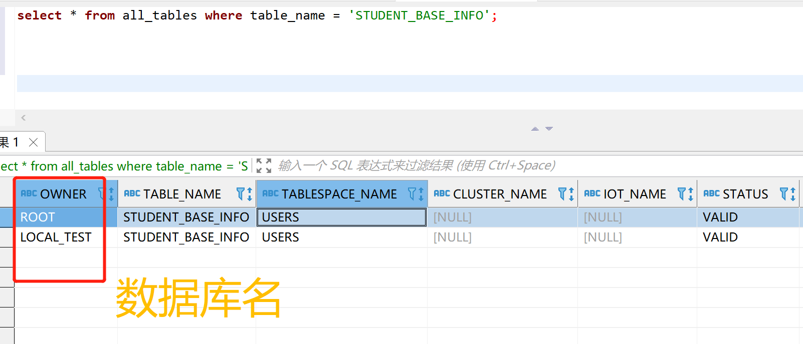
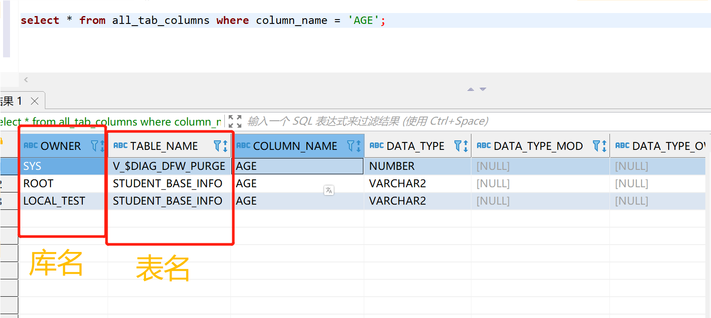
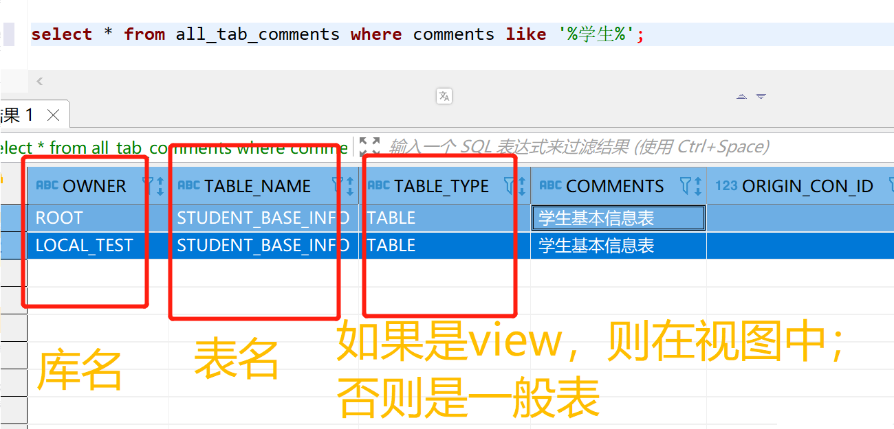

**数据库通过表名、列名(字段名)找到数据库或表之Oracle查找DBName、表名、列名、注释、字段类型、主外键约束信息**

[toc]

> 基本参考转载自 [oracle通过 表名、列名、字段名、注释 找到所在库 或者所在表](https://blog.csdn.net/samur2/article/details/121272477) 和 [查看oracle中查询表的信息，包括表名，字段名，字段类型，主键，外键唯一性约束信息 等](https://blog.csdn.net/weixin_43513408/article/details/117911883)

> 注意：在 Oracle 系统表中查找表名、列名等，必须全为大写。具体参见示例。

# all_tables - 通过表名找到所在库

**从 `all_tables` 表中查找一个表的 OWNER、TABLESPACE_NAME 字段。**

比如，查找`STUDENT_BASE_INFO`表所在库：

```sql
select * from all_tables where table_name = 'STUDENT_BASE_INFO';
```




# all_tab_columns - 通过列名找所在的表或数据库

**通过 `all_tab_columns` 数据库可以查看表的列名的信息。**

比如，查找列名 age 位于哪张表里面，执行下面的sql：

```sql
select * from all_tab_columns where column_name = 'AGE';
```

> 注意 AGE 大写。




# all_tab_comments - 通过 注释 找到所在表或数据库

**借助 all_tab_comments 表。**

查找包含“学生”的注释的表/视图信息:

```sql
select * from all_tab_comments where comments like '%学生%';
```



# user_tables - 查询出所有的用户表

`select * from user_tables` 可以查询出所有的用户表

`select owner,table_name from all_tables;` 查询所有表，包括其他用户表

通过表名过滤要转换为大写：

```sql
select * from user_tables where table_name = upper('表名')
```

无论建立表的时候表名是大写还是小写，`create`语句执行通过之后，对应的`user_tables`表中的`table_name`字段都会自动变为大写字母，所以必须通过内置函数`upper`将字符串转化为大写字母进行查询，否则，即使建表语句执行通过之后，通过上面的查询语句仍然查询不到对应的记录。

# user_indexes、user_ind_columns - 查询用户表的索引信息

## 查询出用户所有表的索引

```sql
select * from user_indexes
```

## 查询用户表的非唯一索引:

```sql
select * from user_indexes where uniqueness='NONUNIQUE'
```

## 查询用户表的主键(聚集索引):

> 此处未验证 Oracle 中的 主键索引、唯一索引、聚集索引、非聚集索引 与 非唯一索引 之间的等同关系。

```sql
select * from user_indexes where uniqueness='UNIQUE'
```

## 查询表的索引

```sql
select t.*,i.index_type from user_ind_columns t,user_indexes i where t.index_name = i.index_name and
t.table_name='NODE'
```

# user_constraints、user_cons_columns 约束信息

## 查询表的主键

```sql
select cu.* from user_cons_columns cu, user_constraints au where cu.constraint_name = au.constraint_name and
au.constraint_type = 'P' AND cu.table_name = 'NODE'
```

## 查找表的唯一性约束（包括名称，构成列）：


```sql
select column_name from user_cons_columns cu, user_constraints au where cu.constraint_name=au.constraint_name and
cu.table_name='NODE'
```

## 查找表的外键

```sql
select * from user_constraints c where c.constraint_type = 'R' and c.table_name='STAFFPOSITION'
```

- 查询外键约束的列名：

```sql
select * from user_cons_columns cl where cl.constraint_name = 外键名称
```

- 查询引用表的键的列名：

```sql
select * from user_cons_columns cl where cl.constraint_name = 外键引用表的键名
```

# 查询用户表的所有列及其属性

方法一：

```sql
select * from user_tab_columns where table_name=upper('表名');
```

方法二：

```sql
select cname,coltype,width from col where tname=upper('表名');;
```
 
# 查询一个用户中存在的过程和函数

```sql
select object_name,created,status from user_objects 

where lower(object_type) in ('procedure','function');
```
 

# 查询其它角色表的权限

```sql
select * from role_tab_privs ;
```
 
# 查看一个表中的索引个数和类别

select * from user_indexes where table_name='表名' ;

# 查看索引被索引的字段

```sql
select * from user_ind_columns where index_name=upper('&index_name');
```


# 查看某表的约束条件


```sql
select constraint_name, constraint_type,search_condition, r_constraint_name
from user_constraints where table_name = upper('&table_name');
```

```sql
select c.constraint_name,c.constraint_type,cc.column_name
from user_constraints c,user_cons_columns cc
where c.owner = upper('&table_owner') and c.table_name = upper('&table_name')
and c.owner = cc.owner and c.constraint_name = cc.constraint_name
order by cc.position;
```

# user_views - 查看用户视图的所有视图名称

```sql
select view_name from user_views;
```
