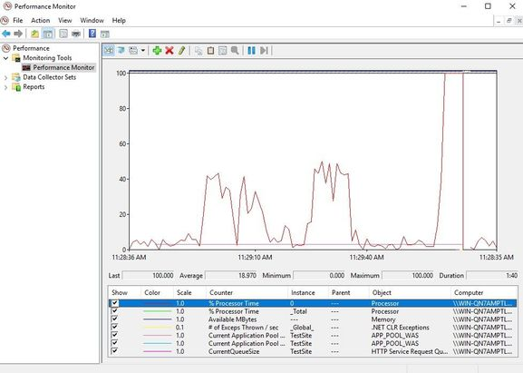
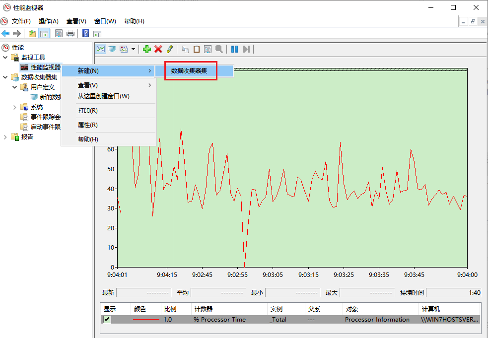
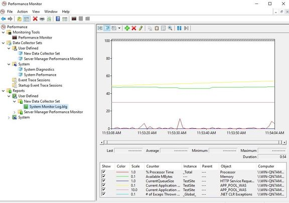

**监控IIS的性能计数器【译】**

[toc]

> 翻译自 [Performance Counters for Monitoring IIS](https://techcommunity.microsoft.com/t5/iis-support-blog/performance-counters-for-monitoring-iis/ba-p/683389)

IIS的默认配置已经对速度进行了优化，然而，可能由于低效的应用代码等原因，会导致站点加载变慢。

如果想要监视IIS服务器资源的使用，推荐检查下面的性能计数器：

- **Processor** (All instances – % Processor Time): 进程的 CPU 消耗
- **Memory** (Available Mbytes): Windows服务器可用的内存
- **HTTP Service Request Queues** (CurrentQueueSize): IIS队列中的请求数量
- **.NET CLR Exceptions** (# of Exceptions Thrown/sec): System.NullReferenceException 抛出的数量
- **APP_POOL_WAS** (For all listed Application Pools):
    - Current Application Pool State: 应用程序池的状态
    - Current Application Pool Uptime: 自上次重新启动以来的 Web 应用程序正常运行时间

  

为了可以监视性能计数器：

1. 点击开始菜单
2. 搜索 “Performance Monitor”（性能计数器）
3. 点击窗口顶部的绿色加号(+)
4. 选择类别(Processor, Memory 等)
5. 选择子分类 (% Processor Time, Available Mbytes 等)
6. 选择一个对象 (`_Total`, `<All instances>` 等)
7. 点击 “添加”（Add）
8. 点击 “确定”（OK）

按照上述说明，你可以监控服务器的实时统计信息。

如果要保存结果：

1. 右键“监视工具”下的“性能监视器”
2. 选择“新建 > 数据收集器集”
3. 输入名称并点击“下一步”
4. 选择保存数据的文件夹，点击“下一步”
5. 勾选“立即启动该数据收集器集”，并点击“完成”
6. 收集器集上将会有一个箭头图标，表示正在记录日志。想要停止记录，右键收集器集并选择“停止”
7. 打开在在第4步中指定的路径，或者，点击“最新报告(`Latest report`)”按钮（绿色书本图标）查看报告

  

  