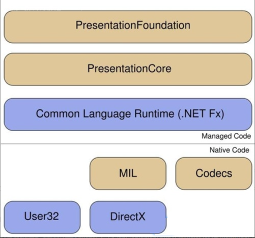

**细数改善WPF应用程序性能的10大方法[转]**

[toc]

> 原文 [细数改善WPF应用程序性能的10大方法](https://www.cnblogs.com/therock/articles/2136648.html)

WPF(Windows Presentation Foundation)应用程序在没有图形加速设备的机器上运行速度很慢是个公开的秘密，给用户的感觉是它太吃资源了，WPF程序的性能和硬件确实有很大的关系，越高档的机器性能越有优势。

程序性能改善不是一蹴而就的，好的设计可以消除影响性能的问题，例如，在运行时构造对象就会对程序的性能造成影响。

虽然WPF通过增强的导航等功能提供了更丰富的用户界面，但你应该考虑你的用户是否的确需要富图形界面，尽管WPF有这样那样的问题，但在UI设计，特别是自定义风格和控件模板方面，的确给开发人员提供了不少灵活性。



渲染WPF程序的主要因素是它包含的像素量，WPF使用微软的DirectX在程序运行的硬件上进行渲染，因此，如果你的机器有独立显卡，运行WPF程序会更流畅。

除了提高硬件配置外，我们来看看10个提高WPF程序性能的软方法。

# 1、降低BitmapScalingMode，加速图像渲染

当你的WPF程序中包含有动画时，你可以使用RenderOptions对象的BitmapScalingMode属性降低资源消耗，需要将BitMapScalingMode属性的值设为LowQuality，这样就会使用加速算法处理图像，而不是默认的高质量图像重采样算法。

下面的代码片段显示了最基本的实现方法：

```C#
RenderOptions.SetBitmapScalingMode(imageObject,BitmapScalingMode.LowQuality);
```

# 2、在正确的地方使用正确的元素

我们需要在正确的地方使用正确的元素，当你生成树时应避免使用UIElements作为子或嵌套控件，最好的例子是FlowDocument，我们经常在FlowDocument中使用TextBlock元素。

```xml
<FlowDocument>
    <Paragraph>
      <TextBlock>some text</TextBlock>
    </Paragraph>
  </FlowDocument>
```

除了上面这样写外，我们还可以象下面这样重写XAML内容，**Run元素不是UIElement，渲染时系统开销更小**。

```xml
<FlowDocument>  <Paragraph>    <Run>some text</Run>  </Paragraph> </FlowDocument>
```

类似的例子是使用Label控件的Content属性，如果在其生命周期内内容不止更新一次，并且是个字符串，这个数据绑定过程可能会阻碍程序的性能，由于内容是一个字符串，在数据绑定期间它会被丢弃，并重新创建。在这种情况下使用TextBlock将数据绑定到Text属性更有效。

在可视化树中出现不必要的元素也会降低WPF程序的速度，你最好结合布局，优化默认的控件模板。　

# 3、增加静态资源的使用

静态资源是预定义的资源，可以连接到XAML属性，它类似于编译时绑定，不会影响性能，另一方面，动态资源涉及到运行时查找和对象的构建，从而会影响到性能。

但也需要注意，静态资源需要在编译时展示(存在)。

静态资源的引用可以参考下面的方法：

```xml
<Button
        Template="{StaticResource RoundButtonWithThickEdge}"
         x:Name="button1" Content="Button 1" >
  </Button>
```

下面的代码片段显示了静态资源R`oundButtonWithThickEdge`的定义：

```xml
<ControlTemplate
       x:Key="RoundButtonWithThickEdge"
       TargetType="{x:Type Button}">
       <Grid>
         <Ellipse Fill="{TemplateBinding Background}"
           Stroke="{x:Null}"
           HorizontalAlignment="Stretch" x:Name="ellipse"/>
             <ContentPresenter HorizontalAlignment="Center" VerticalAlignment="Center"/>
                 <Ellipse Stroke="{x:Null}" Margin="2,3,4,5">
                   <Ellipse.Fill>
                     <LinearGradientBrush EndPoint="0.5,1" StartPoint="0.5,0">
                   <GradientStop Color="#FFFBFAFA" Offset="0"/>
                  <GradientStop Color="#1DFFFFFF" Offset="1"/>
             </LinearGradientBrush>
           </Ellipse.Fill>
         </Ellipse>
       </Grid>
     </ControlTemplate>
```

# 4、当你想显示大型数据时，使用UI虚拟化的控件

想象一下，一个组合框绑定大量行时的样子，它会让组合框中项目的展现变得非常慢，这是因为在这种情况下，程序需要计算每个项目的具体显示位置，使用WPF时，你可以延迟这个行为，这就叫做UI虚拟化，它只会在其可见范围内生产项目显示需要的容器。

要实现这种效果，你需要将相应控件的`IsVirtualizing`属性设为`True`。

例如，Listbox 经常用来绑定大型数据集，它是UI虚拟化的重要候选者，其它适宜UI虚拟化的控件包括 Combobox，ListView 和 TreeView。

# 5、使用延迟滚动增强用户体验

如果你还记得可滚动的 DataGrid 或 ListBox，它们往往会降低整个应用程序的性能，因为在滚动时会强制连续更新，这是默认的行为，在这种情况下，我们可以使用控件的延迟滚动(`Deferred Scrolling`)属性增强用户体验。

你需要做的仅仅是将`IsDeferredScrollingEnabled`附加属性设为`True`。

# 6、使用字体缓存服务提高启动时间

WPF应用程序之间可以共享字体数据，它是通过一个叫做`PresentationFontCache Service`的Windows服务实现的，它会随Windows自动启动。

你可以在控制面板的“服务”中找到这个服务(或在“运行”框中输入`Services.msc`)，确保这个服务已经启动。

# 7、使用卸载事件卸载不必要的动画

动画肯定会占用一定的资源，如果处置方式不当，将会消耗更多的资源，当你认为它们无用时，应该考虑如何处理他们，如果不这样做，就要等到可爱的垃圾回收器先生来回收资源。

例如，假设要删除一个`StoryBorad`，在`Unload`事件中使用`StoryBorad`的`Remove`方法，下面的例子来自MSDN。

```xml
<EventTrigger RoutedEvent="Page.Unloaded" >
          <EventTrigger.Actions>
            <RemoveStoryboard BeginStoryboardName="myBeginStoryboard" />
          </EventTrigger.Actions>
  </EventTrigger>
```

# 8、使用容器回收提高性能

你可以通过回收执行虚拟化的容器来提高性能。

下面的代码片段将`ViruatlizationMode`设为`Recycling`，它让你可以获得更好的性能。当用户滚动或抵达另一个项目时，它强制重复使用容器对象。

```C#
settingVirtualizingStackPanel.VirtualizationMode="Recycling"
```

# 9、预测图像绘制能力

**使用 `RenderCapability.Tier` 属性确定机器是支持硬件加速，还是部分硬件加速，抑或没有硬件加速。**

下面的代码显示了你要如何检查Tier。

```C#
int displayTier = (System.Windows.Media.RenderCapability.Tier > 16)
  
  if (displayTier == 0)
  {
     //no hardware acceleration
  }
  else if (displayTier == 1)
  {
     //partial hardware acceleration
  }
  else
  {
     //supports hardware acceleration
  }
```

确定了之后，你就可以有选择性地，选择那些在用户硬件上工作得很好的功能

# 10、使用WPF分析工具分析WPF程序

分析WPF程序是理解其行为很重要的一步，市场上有大量现成的WPF程序分析工具，如`Snoop`，`WPFPerf`，`Perforator`和`Visual Profiler`，其中`Perforator`和`Visual Profiler`是`WPF Performance Suite`的一部分，要了解这些工具的用法，请去它们的项目主页。

相关阅读：

- [详解WPF扩展玻璃效果（Aero Glass）](http://tech.it168.com/a2010/1008/1111/000001111226.shtml "详解WPF扩展玻璃效果（Aero Glass）")
- [超赞的四款WPF辅助开发免费工具](http://tech.it168.com/a2010/1013/1113/000001113030.shtml "超赞的四款WPF辅助开发免费工具 ")
- [WPF学习之路:从HelloWorld到WPF World](http://tech.it168.com/a2010/1019/1115/000001115519.shtml "WPF学习之路:从HelloWorld到WPF World")