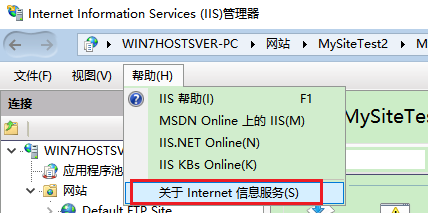

**获取IIS版本的方法总结：从代码、注册表、命令行、应用中，检查IIS是否安装【C#】**

[toc]

# 一

```C#
public Version GetIisVersion()
{
    using (RegistryKey componentsKey = Registry.LocalMachine.OpenSubKey(@"Software\Microsoft\InetStp", false))
    {
        if (componentsKey != null)
        {
            int majorVersion = (int)componentsKey.GetValue("MajorVersion", -1);
            int minorVersion = (int)componentsKey.GetValue("MinorVersion", -1);

            if (majorVersion != -1 && minorVersion != -1)
            {
                return new Version(majorVersion, minorVersion);
            }
        }

        return new Version(0, 0);
    }
}
```

# 二

`SERVER_SOFTWARE` variable. It will return the following:

Microsoft-IIS/5.0 (Windows 2000)
Microsoft-IIS/5.1 (Windows XP)
Microsoft-IIS/6.0 (Windows 2003 Server)

If you're using ASP.NET, you can get this string ：

```C#
Request.ServerVariables["SERVER_SOFTWARE"];

// 或

System.Web.HttpRequest.ServerVariables("SERVER_SOFTWARE");

// 

HttpContext.Current.Request.ServerVariables["SERVER_SOFTWARE"];
```

# 三

```C#
// inetinfo.exe 文件
FileVersionInfo verinfo = FileVersionInfo.GetVersionInfo(System.Environment.SystemDirectory + @"\inetsrv\inetinfo.exe");
string version =  verinfo.FileMajorPart;

// 或 w3wp.exe 文件

string w3wpPath = Path.Combine(
    Environment.GetFolderPath(Environment.SpecialFolder.System), 
    @"inetsrv\w3wp.exe");
FileVersionInfo versionInfo = FileVersionInfo.GetVersionInfo(w3wpPath);
Console.WriteLine(versionInfo.FileMajorPart);
```

# 注册表


U can find it in the registry.

Up to IIS version 6 you can find it here:

`HKLM\SYSTEM\CurrentControlSet\Services\W3SVC\Parameters`

Since version 7 here:

`HKEY_LOCAL_MACHINE\SOFTWARE\Microsoft\InetStp`

MajorVersion MinorVersion

或`VersionString`：`HKEY_LOCAL_MACHINE\SOFTWARE\Microsoft\InetStp\VersionString`  

# Powershell - (1)

```sh
Get-ItemProperty -Path registry::HKEY_LOCAL_MACHINE\SOFTWARE\Microsoft\InetStp\ | Select-Object
```

#  Powershell - (2)

```sh
[System.Diagnostics.FileVersionInfo]::GetVersionInfo("$env:SystemRoot\system32\inetsrv\InetMgr.exe").ProductVersion

// .FileVersion
```

#  Powershell - (3)

Execute `$PSVersionTable` command -> BuildVersion Item: Web server (IIS) Version information is displayed.

```sh
PS > $PSVersionTable

Name                           Value
----                           -----
PSVersion                      5.1.19041.2364
PSEdition                      Desktop
PSCompatibleVersions           {1.0, 2.0, 3.0, 4.0...}
BuildVersion                   10.0.19041.2364
CLRVersion                     4.0.30319.42000
WSManStackVersion              3.0
PSRemotingProtocolVersion      2.3
SerializationVersion           1.1.0.1
```

# `reg query` - cmd 和 Powershell

```sh
reg query HKLM\SOFTWARE\Microsoft\InetStp
```

# wmic 命令行检查文件版本(可放在批处理文件中) - cmd 

```sh
wmic datafile where name='c:\\windows\\system32\\inetsrv\\InetMgr.exe' get version

wmic datafile where name='c:\\windows\\system32\\notepad.exe' get version
```
# IIS管理器的"帮助"-“关于”

  


# [System.Environment.OSVersion](http://msdn.microsoft.com/en-us/library/system.environment.osversion.aspx)

# 其他

如何使用？：

```C#
HttpRuntime.IISVersion
```

# 浏览器访问`http://localhost/`


# http header

It is usually presented in http header of response, as i know.

```C#
HttpWebRequest myHttpWebRequest = (HttpWebRequest)WebRequest.Create("http://127.0.0.1/");
HttpWebResponse myHttpWebResponse = null;
try
{
    myHttpWebResponse = (HttpWebResponse)myHttpWebRequest.GetResponse();
}
catch (WebException ex)
{
    myHttpWebResponse = (HttpWebResponse)ex.Response;
}
string WebServer = myHttpWebResponse.Headers["Server"];
myHttpWebResponse.Close();
```

# 批处理参考

```vb
Set wshshell = CreateObject("WScript.Shell")
Set filesys = CreateObject("Scripting.FileSystemObject")
on error resume next

if filesys.FileExists("c:\program files\Skype\Phone\Skype.exe") then FILEVERSION = filesys.GetFileVersion("c:\program files\Skype\Phone\Skype.exe")
if filesys.FileExists("c:\program files (x86)\Skype\Phone\Skype.exe") then FILEVERSION = filesys.GetFileVersion("c:\program files (x86)\Skype\Phone\Skype.exe")
if FILEVERSION = VERSION then
wscript.quit 0
else
wscript.quit 1626
end if
```

# IIS Versions

> The version of IIS is specifically tied to the OS, it cannot be upgraded without upgrading the OS. Those OS versions always map to those IIS versions.

http://support.microsoft.com/kb/224609

5.0 Built-in component of Windows 2000. Windows 2000
5.1 Built-in component of Windows XP Professional. Windows XP Professional
6.0 Built-in component of Windows Server 2003. WIndows Server 2003
7.0 Built-in component of Windows Vista and Windows Server 2008. Windows Vista and WIndows Server 2008
7.5 Built-in component of Windows Server 2008 R2/ Windows7

# 检查IIS是否安装

## 注册表中是否存在版本判断是否安装

```C#
public static bool IisInstalled()
{
    try
    {
        using (RegistryKey iisKey = Registry.LocalMachine.OpenSubKey(@"Software\Microsoft\InetStp"))
        {
            return (int)iisKey.GetValue("MajorVersion") >= 6;
        }
    }
    catch
    {
        return false;
    }
}
```

或者判断`VersionString`是否为空

```C#
static bool IsIisInstalled() => Registry.GetValue(@"HKEY_LOCAL_MACHINE\SOFTWARE\Microsoft\InetStp", "VersionString", null) != null;
```

## 判断IIS服务 w3svc 是否存在

```C#
IsIisInstalled = ServiceController.GetServices().Any(s => s.ServiceName.Equals("w3svc", StringComparison.InvariantCultureIgnoreCase));
```

## 判断 `%windir%\System32\inetsrv\w3wp.exe` 文件是否存在【未必准确】

## 通过 DISM 判断是否安装，并编程方式安装IIS【最准确】

[installed programmatically using DISM](https://stackoverflow.com/a/54823436/2279059)

## 运行`inetmgr`是否打开IIS管理器，判断是否安装

## 运行`services.msc`，在服务中查看是否存在 IIS ADMIN 服务

# 参考出处

[How to detect IIS version using C#?](https://stackoverflow.com/questions/446390/how-to-detect-iis-version-using-c)

[_how to check the version of the OS_](http://stackoverflow.com/questions/545666/how-to-translate-ms-windows-os-version-numbers-into-product-names-in-net)

[How do I determine which version of IIS is running](https://social.msdn.microsoft.com/Forums/en-US/06780d1a-a2da-403c-8623-04b9c93c90a0/how-do-i-determine-which-version-of-iis-is-running?forum=iis56general) 

[how to know IIS installed or not Programmatically](https://stackoverflow.com/questions/37846864/how-to-know-iis-installed-or-not-programmatically)

[Windows Server 2019：Web server (IIS) version verification procedure](https://inab818.site/en/microsoft-windows-server-2019/windows2019-en-iis-version-verification/)