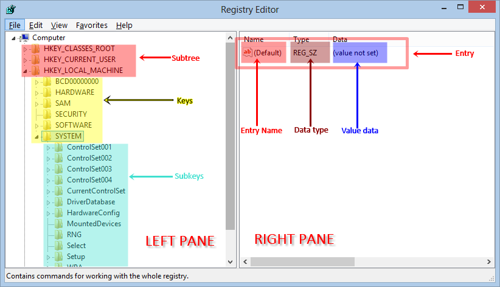

1. php 是否应该 TCMalloc Jemalloc

[php Allocator Jemalloc TCMalloc那个内存分配器比较好？](https://www.cnblogs.com/zdz8207/p/php-Allocator.html)


2. [CentOS7 复制文件夹和移动文件夹](https://blog.csdn.net/haopeng7816/article/details/83960155)


3. [C#工作总结（二）：Webbrower使用注意事项总结](https://blog.csdn.net/ZslLoveMiwa/article/details/80616399)

4. [MVC WebAPI自动生成帮助文档(转)](https://www.cnblogs.com/xcsn/p/7798531.html)

5. [HTML5商城开发三 jquery 星星评分插件](https://www.cnblogs.com/xcsn/p/7779269.html)

6. [How do I set system environment variables in Windows 10](http://superuser.com/questions/949560/how-do-i-set-system-environment-variables-in-windows-10)


7. [Create an ASP.NET Core web app with user data protected by authorization](https://learn.microsoft.com/en-us/aspnet/core/security/authorization/secure-data?view=aspnetcore-7.0)

- [Simple authorization](https://learn.microsoft.com/en-us/aspnet/core/security/authorization/simple?view=aspnetcore-7.0)
- [Role-based authorization](https://learn.microsoft.com/en-us/aspnet/core/security/authorization/roles?view=aspnetcore-7.0)
- [Claims-based authorization](https://learn.microsoft.com/en-us/aspnet/core/security/authorization/claims?view=aspnetcore-7.0)
- [Policy-based authorization](https://learn.microsoft.com/en-us/aspnet/core/security/authorization/policies?view=aspnetcore-7.0)
- [Authorization policy providers](https://learn.microsoft.com/en-us/aspnet/core/security/authorization/iauthorizationpolicyprovider?view=aspnetcore-7.0)
- [Customize the behavior of AuthorizationMiddleware](https://learn.microsoft.com/en-us/aspnet/core/security/authorization/customizingauthorizationmiddlewareresponse?view=aspnetcore-7.0)


8. [【zabbix】Windows服务器获取IIS站点以及程序池状态](https://blog.csdn.net/enweitech/article/details/78805276)


9. HKLM - HKEY_LOCAL_MACHINE 的缩写，H应该表示的是`registry hives`(注册表配置单元)

HKEY_LOCAL_MACHINE

HKEY prefix is common to all the registry hives, and the local machine hive is meant for settings that affect every user.

the 'H' in 'HKEY' really stands for 'hive'：https://msdn.microsoft.com/pt-br/library/windows/desktop/ms724877(v=vs.85).aspx

[What Is a Registry Hive?](https://www.lifewire.com/what-is-a-registry-hive-2625986)

A hive in the Windows Registry is the name given to a major section of the registry that contains registry keys, registry subkeys, and registry values.

[What Is HKEY_LOCAL_MACHINE?](https://www.lifewire.com/hkey-local-machine-2625902)

[What does HKLM in MS windows stand for?](https://stackoverflow.com/questions/2185123/what-does-hklm-in-ms-windows-stand-for)：

Microsoft Windows operating systems under Windows NT family use a multipart database commonly known as the Registry; to hold system and user configuration information. The contents of this database are stored in five files referred to as Hives.

Subtree – These are the root primary (root) divisions.
Key - Keys are the next division down from subtree, which contain at least one subkey. Some subtrees do not have keys.
Subkey - Subkeys are the next level down from keys or subtrees i.e. if the subtree has no keys. These store entries and other subkeys.
Entry – These appear on the right pane of the Registry editor window and happen to be the lowest-level element in the Registry. Normally an entry has 3 properties i.e. Name, Value and Data type. Data types serve the function of defining the length and format of the actual Operating System and programs configuration data that an entry can hold in the value field. Entries differ from subtrees, keys, and subkeys, as they are merely containers. To reference an entry you need its Registry path and name
Hive Files – These are a set of files where permanent parts of the Registry are stored. They store data for four keys i.e. SAM, SECURITY, SOFTWARE and DEFAULT; and are saved in %System32%\Config, normally updated with user each login.
Note: subtrees, keys, subkeys appear as folders on the left pane. Entries appear on the right pane

  

[Understanding the Registry on Windows](https://kb.uconn.edu/space/IKB/10737647782/Understanding+the+Registry+on+Windows)


10. [Everything In Active Directory via C#](https://daoudisamir.com/everything-in-active-directory-via-c/)

11. [Installing and removing fonts using C#](https://daoudisamir.com/installing-and-removing-fonts-using-c/) 使用C#安装和卸载字体

12. https://learn.microsoft.com/en-us/previous-versions/aspnet/ms366723(v=vs.100)?redirectedfrom=MSDN

13. [Performance Improvements in .NET 6](https://devblogs.microsoft.com/dotnet/performance-improvements-in-net-6/)

14. [JsonPatch in ASP.NET Core web API](https://learn.microsoft.com/en-us/aspnet/core/web-api/jsonpatch?view=aspnetcore-6.0)

[Json Patch (1) In ASP.NET Core web API](https://www.c-sharpcorner.com/article/json-patch-in-asp-net-core-web-api/)

15. [Introduction to System.Text.Json Through Examples](https://code-maze.com/introduction-system-text-json-examples/)

[Compare Newtonsoft.Json to System.Text.Json, and migrate to System.Text.Json](https://learn.microsoft.com/en-us/dotnet/standard/serialization/system-text-json/migrate-from-newtonsoft?pivots=dotnet-7-0)

[Try the new System.Text.Json APIs](https://devblogs.microsoft.com/dotnet/try-the-new-system-text-json-apis/)

16. [比较不错的 .NET Core 内置的 System.Text.Json 使用注意](https://blog.csdn.net/wulex/article/details/118931531)

可以通过自定义`JsonConverter`来处理不支持的类型转换，下面只实现了一个`Guid`的自定义转换，在实现`Guid?`的时候，发现在重写`Read`方法时候，返回默认的`default` (return null) 的时候，在序列化的时候，好像不走`Write`方法，不能自定义输出结果，该属性的序列化的值一直是`null`，在反序列化时候返回默认的`Guid`，可以解决。

```csharp
using System;
using System.Buffers;
using System.Buffers.Text;
using System.Text.Json;
using System.Text.Json.Serialization;

namespace q_120383
{
    class Program
    {
        static void Main(string[] args)
        {
            var options = new JsonSerializerOptions
            {
                Converters = {new EmptyStringToGuidConverter()}
            };
            var testJsonStr = "{\"UserId\":\"\",\"Name\":\"\"}";
            var p = JsonSerializer.Deserialize<Person>(testJsonStr, options);
            Console.WriteLine(p.UserId);
            var s = JsonSerializer.Serialize(p, options);
            Console.WriteLine(s);
        }
    }

    public class Person
    {
        public Guid UserId { get; set; }
        public string Name { get; set; }
    }

    public class EmptyStringToGuidConverter : JsonConverter<Guid>
    {
        public override Guid Read(ref Utf8JsonReader reader, Type typeToConvert, JsonSerializerOptions options)
        {
            if (reader.TokenType == JsonTokenType.Null)
                return Guid.Empty;

            if (reader.TokenType == JsonTokenType.String)
            {
                ReadOnlySpan<byte> span = reader.HasValueSequence ? reader.ValueSequence.ToArray() : reader.ValueSpan;
                if (Utf8Parser.TryParse(span, out Guid value, out var bytesConsumed) && span.Length == bytesConsumed)
                    return value;

                return Guid.Empty;
            }

            throw ThrowHelper.GetFormatException(DataType.Guid);
        }

        public override void Write(Utf8JsonWriter writer, Guid value, JsonSerializerOptions options)
        {
            if (Guid.Empty.Equals(value))
                writer.WriteStringValue("");
            else
                writer.WriteStringValue(value.ToString());
        }
    }
}
```

# ASP.NET CORE 混合模型绑定

[MIXED MODEL BINDING IN ASP.NET CORE](https://www.seeleycoder.com/blog/mixed-model-binding-aspnetcore/)

[为ASP.NET Core实现一个自适应ModelBinder，让Action自适应前端参数传递](https://zhuanlan.zhihu.com/p/479279085)

# [http请求头中的content-type属性](https://www.cnblogs.com/yanggb/p/11684494.html)

# [FormData简介](https://zhuanlan.zhihu.com/p/111480177)