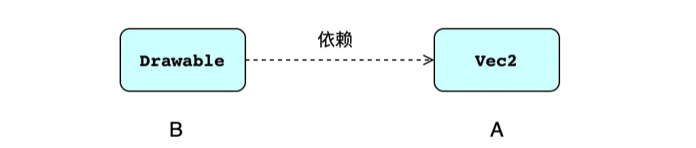
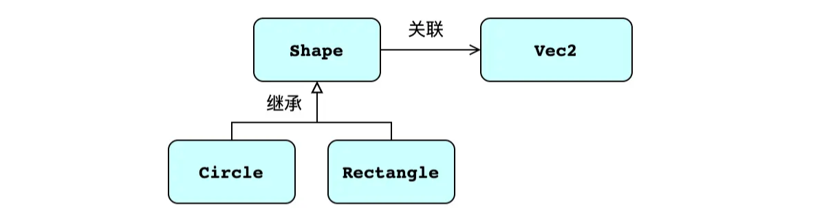

**[Flutter]足够入门的Dart语言系列之面向对象：类之间的6大关系**

[toc]

无论是面向对象编程，还是面向过程、函数式编程，代码与代码之间的组织关系都是最重要的。通过代码的编写、代码间的相互调用、不同代码的合理使用、集合不同的数据和方法，才能保证一个程序正确、稳定、高效的运行。

面向对象编程是基于类实现的，类体现了对象的总结，包含了事物的数据和行为，完成封装。屏蔽了实现细节的类可以方便的创建对象，调用其功能，这就需要保证不同的类和对象之间合理的组织管理，这就引出了“类与类之间的关系”的问题，类与类之间的相互协作，或之间的关系，主要有六大类：

- 依赖关系
- 关联关系
- 聚合关系
- 组合关系
- 继承关系
- 实现关系

# 依赖关系

**在 `B` 类实现功能的逻辑中，使用到 `A` 类对象，称 `B` 依赖于 `A` 。**

如下，`Drawable` 类在 `draw` 方法中使用了 `Vec2` 对象，所以 `Drawable` 的功能依赖于 `Vec2` ，两者是依赖关系。

```dart
class Drawable{
  void draw(Vec2 vec2){
    print("绘制向量(${vec2.x},${vec2.y})");
  }
}

class Vec2{
  double x;
  double y;
  
  Vec2(this.x, this.y);
}
```

**一般通过如下的单向虚线箭头表示依赖关系，其中，箭头指向被依赖方。**

  

依赖关系比较容易形成，但关系比较薄弱，也就是就是 `耦合性低`。依赖关系有一般不需要长期维持，是一种临时关系，只在用到时临时使用。

```dart
Drawable drawable = Drawable();
Vec2 p0 = Vec2(3, 4);
drawable.draw(p0);
```

> 比如快递员给我送一次快递、我出门做一次出租车、外卖员为我送一次餐，这都是临时的依赖关系，依赖对方的服务。


# 关联关系

**关联关系指两个类之间存在固定的对应关系，是一种相对于依赖而言更强的关系**。这种关系一般是长期的，稳定的。

比如 用户User 和 电脑Computer 的关系，User 持有 Computer 是一种强的依赖关系。**被关联者通常以 成员变量 的形式存在于关联者类中**。

```dart
class User{
  User(this.computer);
  Computer computer;
  
  void pressStartButton(){
    computer.open();
  }
}

class Computer{
  Computer(this.name);
  String name;
  
  void open(){
    print("====电脑开机:[${name}]=====");
  }
}
```

在使用时，需要提供Computer的实例，用于 User 中的 computer 成员变量赋值：

```dart
void main(){
  Computer computer = Computer("toly mac");
  User user = User(computer);
  user.pressStartButton();
}
```

**一般通过如下的单向实线箭头表示关联关系，其中，箭头指向被关联方。**

  

**依赖关系 是虚线，表示关系较弱；关联关系 是实线，表示关系稳固。当两各类相互关联时，称 双向关联。**

在 Computer 中添加一个 User 类型的 owner 对象，表示电脑的 所有者，这时 User 和 Computer 就是双向的关联关系。

```dart
class Computer{
  String name;
  User? owner;

  Computer(this.name);

  void open(){
    print("====电脑开机:[${name}]=====");
  }
}
```

用双向实线箭头表示双向关联：

  

# 聚合关系

聚合是一种耦合性更强的关联关系。

一般关联关系的两个类，是相互独立的，各自在地位上平等。而聚合关系在语义上有 **包含** 的涵义，更强调 **整体/个体** 的区别。比如说，对于电脑而言，它和显卡、内存等硬件间就是一种聚合关系。 

```dart
class Computer{ // 电脑
  String name;
  GraphicsCard graphicsCard;
  Memory memory;

  Computer(this.name,this.graphicsCard,this.memory);

  void printConfig(){
    print("====电脑名称:[${name}]=====");
    print("====电脑显卡:[${graphicsCard.name}]=====");
    print("====电脑内存:[${memory.type}:${memory.size}GB]=====");
  }
}

class GraphicsCard{ // 显卡
  String name;
  GraphicsCard(this.name);
}

class Memory{ // 内存
  double size;
  String type;

  Memory(this.type,this.size);
}
```

此外，房子、桌子等各个物件的整体和组成其的部分，都能很好的体现聚合关系。

**一般通过如下的空心菱形实线箭头表示聚合关系，菱形指向整体类，箭头指向个体类。**

  

**聚合关系** 在代码上的表现，和 **关联关系** 一样，也是持有 个体类 作为 成员变量。不过对于聚合来说，两类间的关系更加紧密，耦合性更强，有 `整体/个体` 的区别，在地位上是不平等的。

```dart
GraphicsCard graphicsCard = GraphicsCard("NVIDIA GeForce RTX 3060");
Memory memory = Memory("DDR4", 32);
Computer computer = Computer("toly mac",graphicsCard,memory);
computer.printConfig();
```

# 组合关系

组合是一种 耦合性 比 聚合 更强的 关联关系。

组合同样强调`整体/个体间`的关系，但**要求 `整体` 与 `个体` 不可分割**。这个 `不可分割` 体现在`个体`和`整体` 是一体的，`个体` 的生命周期被 `整体` 控制，`整体` 对象的消亡，也会导致 `个体` 的消亡。

比如 `学生` 和 `学籍档案` 之间的关系，`学生` 学习阶段的变化，学籍档案信息也会随之变化。当学生生涯结束时，档案不再变化，却伴随学生一生。同样的，还是个人与身份证、公司和员工信息之间的关系。

```dart
class Student{
  Document document;

  Student(this.document);

  void event(String string){
    document.records.add(string);
  }

  String callDocument(){
    return document.records.join("\n");
  }

  void died(){
    document.records.clear();
  }
}

class Document{
  List<String> records = [];

  void addRecord(String string){
    records.add(string);
  }
}
```

随着学生活动`event`的进行，档案会跟随变化，档案和学生有着较强的附属关系，两个事物紧紧绑定。

一般通过如下的`实心菱形实线箭头`表示组合关系，菱形指向 `整体类`，箭头指向 `个体类`。从实心和空心上也能感受到 `组合` 的关系更为紧密。

> 依赖、关联、聚合 、组合 四者的耦合性依次增高，本质上四者都是B类需要使用到A类对象，只是类之间关系的紧密程度不同，即`耦合度`或`耦合性`。
> 
> 耦合度越高，各模块间的联系越紧密，独立性就越差，代码拓展或扩展的灵活性也就越低，代码的修改难度也就越大。
> 
> - 依赖 是对 A 的使用，也被称为` use-a` 。
> - 关联、聚合、组合都是持有 A 类成员，称为 `has-a` 。

# 继承关系

继承是面向对象三大基本特征之一 ，广泛地应用于面向对象的开发中。

前面的四种关系都是在使用或持有的层面，`B` 与 `A` 是独立的个体存在。

而**继承在语义上是让 `B` 成为 `A`，此时 `B` 与 `A` 将作为同一类型被对待，被成为 `is-a`，这就表示继承的耦合性要远高于组合**。**在功能上，`B` 类将拥有 `A` 类的所有成员属性和方法 ，让 `B` 类可以使用 `A` 类的数据和功能**。

继承是语法层面的特性（或特性支持），而上面介绍的四种关系都是通过代码在逻辑层面的实现或使用。

通过继承，可以建立一个类族系，通过继承可以很好的体现层级关系或父子关系，这在现实中也有着很好的对应。通过继承上级的族系中的公共成员属性和方法，可以起到很好到的复用价值（复用性）。

如果 `B` 类继承自 `A` 类，则称 `A` 为 `基类` ，也称为 `超类` 或 `父类` ；称 `B` 为 `派生类` 或 `子类`。

下面的 Circle 和 Rectangle 派生类继承自父类Shape，两个类的对象都可以使用基类 Shape 的实例方法和属性。通过 move 方法，center 实例变量会被修改。

```dart
class Shape {
  Vec2 center;

  Shape(this.center);

  void move() {
    center.x += 1;
    center.y += 1;
    print("$runtimeType:move(10,10)==> center:(${center.x},${center.y})");
  }
}

class Circle extends Shape{
  double radius;
  Circle(Vec2 center,{this.radius =10}) : super(center);
}

class Rectangle extends Shape{
  double width;
  double height;

  Rectangle(Vec2 center,{this.width=20,this.height=20}) : super(center);
}
```

**一般通过`单向实线三角空心箭头`表示继承关系，其中箭头指向 `基类` 。**

  

# 实现关系

大多数面向对象的编程语言，都不支持多继承（即一个类继承自多个类）。多继承的问题历来是一个难以处理的问题，很容易产生歧义（即二义性）。如果两个类中的实例变量或实例方法相同，子类未进行重写或覆写，在使用子类对象时就会产生二义性，不知道选择使用哪个父类的属性或方法。

但是，**一个类可以实现多个接口**，因为接口不允许持有实例变量，并且只定义成员方法，要求派生类在继承时必须进行实现。这样，接口就从本质上避免了普通类的多继承的歧义问题。也因此，大多数编程语言，是**通过接口实现的多继承**。

在Dart中没有显式定义接口的方法或关键字。每一个类都隐式地定义了一个接口并实现了该接口。通过`implements`关键字实现一个类的接口而不是继承该类。

通常来说，都是将抽象方法的抽象类视为接口。

下面定义了两个接口，`Calculate`表示该接口拥有计算的能力，`Electric`表示该接口拥有开机（open）、关机（close）的能力。通过`implements`关键字实现类的接口，多个接口通过`,`号隔开。当`Computer`实现`Calculate`和`Electric`接口时，必须实现接口中定义的全部方法。

```dart
abstract class Calculate{
  void calculate();
}

abstract class Electric{
  void open();
  void close();
}

class Computer implements Calculate, Electric{ 
  @override
  void calculate() {
    print("do calculate by computer");
  }

  @override
  void close() {
    print("computer close");
  }

  @override
  void open() {
    print("computer open");
  }
}
```

`Human`类也可以实现`Calculate`接口。

```dart
class Human implements Calculate{
  @override
  void calculate() {
    print("do calculate by Human");
  }
}
```

从两个不同类的不同实现可以看出，**`接口`可以对功能进行`隔离`**，这对于`封装`来说非常重要。

一般通过`单向虚线三角空心箭头`表示实现关系，其中箭头指向`接口类`。

  

# 参考

- [Flutter 语言基础 - 类与类间关系](https://s.juejin.cn/ds/MAHBbno/ "https://s.juejin.cn/ds/MAHBbno/")
