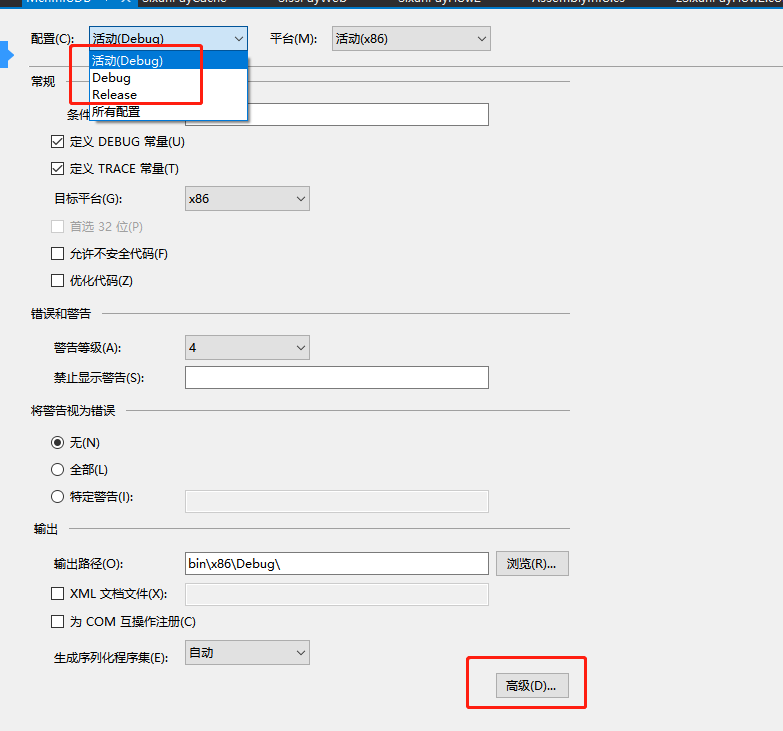

**错误 CS1617 Invalid option '7.3' for /langversion; must be ISO-1, ISO-2, Default or an integer in range 1 to 6.**

[toc]

严重性 代码 说明 项目 文件 行 禁止显示状态
错误 CS1617 Invalid option '7.3' for /langversion; must be ISO-1, ISO-2, Default or an integer in range 1 to 6. \CSC 1 活动

最简单解决办法：

修改生成的配置为`Release`，即非Debug，重新生成即可。不用进行其他任何修改。

- 解决办法：

检查：项目属性- 生成 - 高级，语言版本选择 default。

注意：配置里的 Debug 和 Release 都要改。

  

- 编译器错误 CS1617

Invalid option 'option' for LangVersion. Use <LangVersion>?</LangVersion> to list supported values.

This error occurs if you used the LangVersion command line switch or project setting but didn't specify a valid language option. To resolve this error, check the command line syntax or project setting and change it to one of the listed options.

- `-langversion`的有效值

| Value | Meaning |
| --- | --- |
| `preview` | The compiler accepts all valid language syntax from the latest preview version. |
| `latest` | The compiler accepts syntax from the latest released version of the compiler (including minor version). |
| `latestMajor`  
or `default` | The compiler accepts syntax from the latest released major version of the compiler. |
| `11.0` | The compiler accepts only syntax that is included in C# 11 or lower. |
| `10.0` | The compiler accepts only syntax that is included in C# 10 or lower. |
| `9.0` | The compiler accepts only syntax that is included in C# 9 or lower. |
| `8.0` | The compiler accepts only syntax that is included in C# 8.0 or lower. |
| `7.3` | The compiler accepts only syntax that is included in C# 7.3 or lower. |
| `7.2` | The compiler accepts only syntax that is included in C# 7.2 or lower. |
| `7.1` | The compiler accepts only syntax that is included in C# 7.1 or lower. |
| `7` | The compiler accepts only syntax that is included in C# 7.0 or lower. |
| `6` | The compiler accepts only syntax that is included in C# 6.0 or lower. |
| `5` | The compiler accepts only syntax that is included in C# 5.0 or lower. |
| `4` | The compiler accepts only syntax that is included in C# 4.0 or lower. |
| `3` | The compiler accepts only syntax that is included in C# 3.0 or lower. |
| `ISO-2`  
or `2` | The compiler accepts only syntax that is included in ISO/IEC 23270:2006 C# (2.0). |
| `ISO-1`  
or `1` | The compiler accepts only syntax that is included in ISO/IEC 23270:2003 C# (1.0/1.2). |
